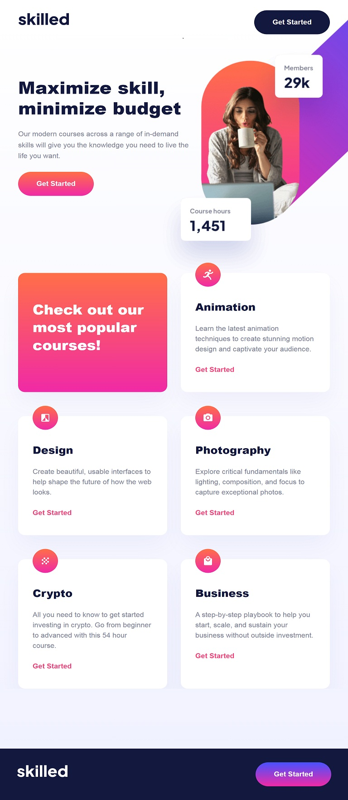

# Frontend Mentor - Skilled e-learning landing page solution

This is a solution to the [Skilled e-learning landing page challenge on Frontend Mentor](https://www.frontendmentor.io/challenges/skilled-elearning-landing-page-S1ObDrZ8q). Frontend Mentor challenges help you improve your coding skills by building realistic projects.

## Table of contents

- [Overview](#overview)
  - [The challenge](#the-challenge)
  - [Screenshot](#screenshot)
  - [Links](#links)
- [My process](#my-process)
  - [Built with](#built-with)
  - [Useful resources](#useful-resources)
- [Author](#author)

## Overview

### The challenge

Users should be able to:

- View the optimal layout depending on their device's screen size
- See hover states for interactive elements

### Screenshot

### Links

- Solution URL: [Frontend mentor solution](https://www.frontendmentor.io/solutions/skilled-elearning-landing-page-using-grid-Y9B1oxvZb0)
- Live Site URL: [Live site at Netlify](https://aurigas-skilled-elearning.netlify.app/)

## My process

### Built with

- Semantic HTML5 markup
- CSS custom properties
- Flexbox
- CSS Grid
- Desktop-first workflow

### Useful resources

- [Andreas Bovens's article at Dev.Opera](https://dev.opera.com/articles/responsive-images) - This is an amazing article which helped me finally understand Responsive Image. I'd recommend it to anyone still learning this concept.

## Author

- Frontend Mentor - [@auriga2124](https://www.frontendmentor.io/profile/auriga2124)
- Twitter - [@ErkaRahman](https://twitter.com/ErkaRahman)
